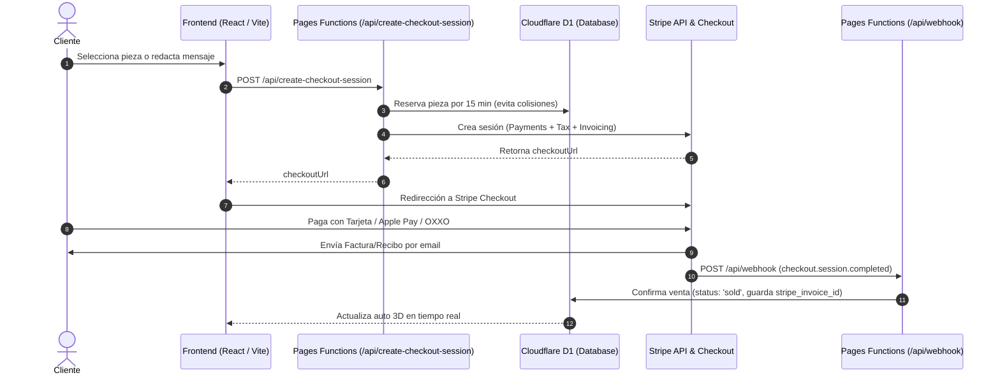

# Guía de Integración de Stripe: Payments, Invoicing y Tax

Esta documentación describe la arquitectura, configuración y funcionamiento del sistema de cobros, facturación e impuestos con **Stripe** para **Proyect Car**.

---

## 1. Visión General de la Arquitectura

El flujo integra tres productos clave de Stripe sobre un backend serverless en **Cloudflare Pages Functions** y base de datos **Cloudflare D1**:

1. **Stripe Payments (Checkout):** Procesamiento seguro y cumplimiento PCI-DSS SAQ A mediante sesiones alojadas por Stripe (`https://api.stripe.com/v1/checkout/sessions`).
2. **Stripe Invoicing:** Emisión automática de facturas oficiales y recibos detallados en PDF para marcas y compradores (`invoice_creation[enabled]=true`).
3. **Stripe Tax:** Cálculo fiscal automático (IVA en México o impuestos según la ubicación del comprador) mediante `automatic_tax[enabled]=true` y recopilación de dirección y RFC/Tax ID.

---

## 2. Documentación de Funciones Específicas

### 2.1 `create-checkout-session.ts` (`POST /api/create-checkout-session`)
- **Propósito:** Validar disponibilidad de piezas, registrar un bloqueo atómico temporal de 15 minutos en D1 y generar la sesión de pago en Stripe con soporte para impuestos y facturación.
- **Parámetros de Entrada:**
  - `partId` *(string)*: Identificador de la pieza o salpicadera.
  - `brand` *(string, opcional)*: Nombre de la marca patrocinadora.
  - `color` *(string, opcional)*: Código HEX del color elegido.
  - `email` *(string)*: Correo electrónico del comprador.
  - `msg` *(string, opcional)*: Texto para el mensaje de la salpicadera.
  - `roofName` *(string, opcional)*: Nombre de cortesía para el techo.
  - `cur` *('MXN' | 'USD')*: Divisa seleccionada.
- **Integración con Stripe:**
  - `mode=payment`
  - `customer_creation=always`: Asegura que Stripe asocie/cree un Customer para adjuntar la factura y la jurisdicción impositiva.
  - `automatic_tax[enabled]=true`: Activa el cálculo automático de impuestos según la ubicación fiscal.
  - `tax_id_collection[enabled]=true`: Habilita el campo para RFC (México) o Tax ID internacional.
  - `billing_address_collection=required`: Obligatorio para la precisión del cálculo fiscal de Stripe Tax.
  - `invoice_creation[enabled]=true`: Genera un comprobante/factura formal descargable.
  - `Idempotency-Key`: Encabezado que garantiza que reintentos de red no dupliquen la reserva ni el cobro.

### 2.2 `webhook.ts` (`POST /api/webhook`)
- **Propósito:** Recibir eventos asíncronos emitidos por Stripe, verificar criptográficamente su autenticidad y persistir el estado de la transacción en D1.
- **Seguridad:**
  - Valida el encabezado `stripe-signature` mediante HMAC-SHA256 usando la Web Crypto API nativa de Cloudflare (`crypto.subtle`).
  - Previene ataques de repetición validando la marca de tiempo (tolerancia máxima de 300 segundos).
- **Eventos Manejados:**
  - `checkout.session.completed`: Marca la pieza como `sold`, vincula `stripe_invoice_id` en `sales` y `messages`, y registra mensajes comunitarios en la base de datos.
  - `checkout.session.expired`: Si el usuario abandonó el checkout, libera la pieza de inmediato (`status = 'available'`) para otros interesados.

### 2.3 `CheckoutModal.tsx` (Frontend)
- Muestra feedback visual inmediato cuando el usuario selecciona **Stripe**, confirmando que incluye factura oficial en PDF con desglose de impuestos y casilla para RFC / Tax ID.
- Bloquea el botón de pago si la pieza está en un apartado temporal activo por otro usuario (`isReserved`) mostrando el tiempo restante en minutos.

---

## 3. Variables de Entorno Requeridas

Configurar en **Cloudflare Pages** (`Settings` > `Environment variables`):

| Variable | Descripción | Ejemplo / Formato |
|---|---|---|
| `STRIPE_SECRET_KEY` | Clave secreta de la API de Stripe | `sk_test_...` o `sk_live_...` |
| `STRIPE_WEBHOOK_SECRET` | Secreto para verificar la firma del Webhook | `whsec_...` |
| `VITE_PAY_MODE` | Modo de operación en el frontend | `live` o `test` |
| `SITE_URL` | URL canónica para las redirecciones | `https://proyectcar.com` |

---

## 4. Configuración en Stripe Dashboard

1. **Stripe Tax:**
   - Activar Stripe Tax en `Dashboard > Tax > Settings`.
   - Establecer la dirección de origen (Head office) en México.
   - Configurar el registro fiscal activo para México (IVA 16%).
2. **Stripe Invoicing & Customer Emails:**
   - Activar el envío automático de correos en `Settings > Customer emails`.
   - Personalizar el diseño y logotipo de la factura en `Settings > Branding`.
3. **Webhook Endpoint:**
   - Crear endpoint apuntando a `https://[tudominio]/api/webhook`.
   - Seleccionar eventos: `checkout.session.completed` y `checkout.session.expired`.

---

## 5. Registro de Cambios y Mejoras Implementadas (Changelog)

1. **Stripe Tax & Fiscalidad:**
   - Añadido `automatic_tax[enabled]=true` y `billing_address_collection=required`.
   - Añadido `tax_id_collection[enabled]=true` para captura de RFC (México) y Tax ID internacional.
   - Precios configurados con `tax_behavior='inclusive'` conforme a la normativa fiscal mexicana.
2. **Stripe Invoicing Oficial:**
   - Habilitado `invoice_creation[enabled]=true` y `customer_creation=always` en `create-checkout-session.ts`.
   - Persistencia de `stripe_invoice_id` en las tablas `sales` y `messages` de Cloudflare D1.
3. **Resiliencia e Idempotencia:**
   - Encabezado `Idempotency-Key` integrado en peticiones a Stripe para evitar dobles cobros por reintentos de red.
4. **Pruebas y CI/CD:**
   - Tests unitarios ampliados en `src/data/checkout.test.ts` cubriendo cálculos de divisas, reglas de negocio y claves de idempotencia.
   - Pipeline de integración continua configurado en `.github/workflows/ci.yml` ejecutado en contenedores Docker como Quality Gate (sin interferir con el despliegue nativo de Cloudflare Pages).

---

## 6. Interacción entre CI/CD y Cloudflare Pages & Workers

Para evitar conflictos o dobles despliegues:
1. **GitHub Actions (CI):** Actúa como filtro de calidad (Quality Gate). Ejecuta `typecheck`, `test` y `build` dentro de contenedores Docker en cada commit o Pull Request. Si hay un error de tipos o falla un test, bloquea el avance.
2. **Cloudflare Pages (CD):** Si tu repositorio está conectado en el panel de Cloudflare (*Pages > Connect to Git*), Cloudflare detecta los cambios en `main` y compila automáticamente:
   - El frontend estático desde `dist/`.
   - Las serverless functions de la carpeta `/functions/` vinculándolas con la base de datos D1 (`DB`) y el bucket R2 (`BUCKET`).
3. **Cero interferencia:** El flujo de GitHub Actions no sobreescribe ni compite con el despliegue de Cloudflare Pages a menos que se configure explícitamente el modo Direct Upload por CLI.
